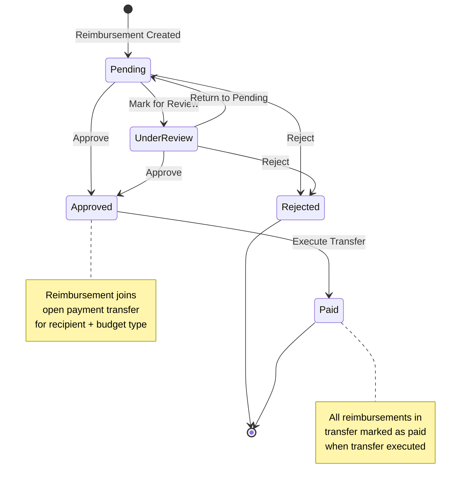

# Design Document - Payment Transfers (העברות תשלום)

## Overview

The Payment Transfers feature introduces a new layer in the reimbursement payment workflow. Instead of marking individual approved reimbursements as "paid", treasurers will now execute payment transfers that group all approved reimbursements by recipient and budget type. This provides better organization, clearer audit trails, and more efficient payment processing.

### Key Concepts

1. **Payment Transfer**: A collection of approved reimbursements for a specific recipient from a specific budget type (circle or group)
2. **Automatic Grouping**: When a reimbursement is approved, it automatically joins an open payment transfer for that recipient and budget type
3. **Transfer Execution**: When a treasurer executes a transfer, all associated reimbursements transition to "paid" status
4. **Budget Type Separation**: Circle and group budget reimbursements are kept in separate transfers even for the same recipient

## Architecture

### Database Schema

#### New Table: payment_transfers

```sql
CREATE TABLE payment_transfers (
  id SERIAL PRIMARY KEY,
  recipient_user_id INTEGER REFERENCES users(id) ON DELETE CASCADE NOT NULL,
  budget_type VARCHAR(20) NOT NULL CHECK (budget_type IN ('circle', 'group')),
  group_id INTEGER REFERENCES groups(id) ON DELETE CASCADE,
  status VARCHAR(20) DEFAULT 'pending' CHECK (status IN ('pending', 'executed')),
  total_amount DECIMAL(12,2) NOT NULL DEFAULT 0 CHECK (total_amount >= 0),
  reimbursement_count INTEGER NOT NULL DEFAULT 0,
  created_at TIMESTAMP DEFAULT NOW(),
  executed_at TIMESTAMP,
  executed_by INTEGER REFERENCES users(id) ON DELETE SET NULL
);

CREATE INDEX idx_payment_transfers_recipient ON payment_transfers(recipient_user_id);
CREATE INDEX idx_payment_transfers_status ON payment_transfers(status);
CREATE INDEX idx_payment_transfers_budget_type ON payment_transfers(budget_type);
CREATE INDEX idx_payment_transfers_group_id ON payment_transfers(group_id);
CREATE INDEX idx_payment_transfers_pending ON payment_transfers(status, created_at) WHERE status = 'pending';
```

**Field Descriptions:**
- `recipient_user_id`: The user who will receive the payment
- `budget_type`: Either 'circle' or 'group' to separate transfers by budget type
- `group_id`: For group budget transfers, stores the specific group (NULL for circle transfers)
- `status`: 'pending' (awaiting execution) or 'executed' (completed)
- `total_amount`: Calculated sum of all associated reimbursements
- `reimbursement_count`: Number of reimbursements in this transfer
- `executed_at`: Timestamp when transfer was executed
- `executed_by`: Treasurer who executed the transfer

#### Modified Table: reimbursements

```sql
ALTER TABLE reimbursements 
ADD COLUMN payment_transfer_id INTEGER REFERENCES payment_transfers(id) ON DELETE SET NULL;

CREATE INDEX idx_reimbursements_payment_transfer_id ON reimbursements(payment_transfer_id);
```

**New Field:**
- `payment_transfer_id`: Links reimbursement to its payment transfer (set when approved, remains after execution for audit trail)

### Data Flow



## Components and Interfaces

### Backend Components

#### 1. Payment Transfer Controller (`paymentTransferController.ts`)

**Responsibilities:**
- Manage payment transfer CRUD operations
- Execute payment transfers
- Retrieve transfer details with associated reimbursements
- Calculate transfer totals and statistics

**Key Functions:**

```typescript
// Get all payment transfers (with access control)
export async function getPaymentTransfers(req: Request, res: Response)

// Get single payment transfer with details
export async function getPaymentTransferById(req: Request, res: Response)

// Execute a payment transfer (mark as executed, update reimbursements to paid)
export async function executePaymentTransfer(req: Request, res: Response)

// Get payment transfer statistics
export async function getPaymentTransferStats(req: Request, res: Response)

// Internal: Create or get open transfer for recipient and budget type
async function getOrCreateOpenTransfer(recipientUserId: number, budgetType: string, groupId: number | null)

// Internal: Update transfer totals
async function updateTransferTotals(transferId: number)

// Internal: Associate reimbursement with transfer
async function associateReimbursementWithTransfer(reimbursementId: number, recipientUserId: number, fundId: number)
```

#### 2. Modified Reimbursement Controller

**Changes to Existing Functions:**

```typescript
// approveReimbursement - Add transfer association logic
export async function approveReimbursement(req: Request, res: Response) {
  // ... existing approval logic ...
  
  // After approval, associate with payment transfer
  await associateReimbursementWithTransfer(
    reimbursementId, 
    recipientUserId, 
    fundId
  );
}

// batchApprove - Add transfer association for each approved reimbursement
export async function batchApprove(req: Request, res: Response) {
  // ... existing batch approval logic ...
  
  // For each successfully approved reimbursement
  for (const id of successIds) {
    await associateReimbursementWithTransfer(id, recipientUserId, fundId);
  }
}

// getTreasurerReimbursements - Add budget type filtering
export async function getTreasurerReimbursements(req: Request, res: Response) {
  // Add WHERE clause to filter by budget type based on treasurer role
  // Circle treasurer: only circle budgets (b.group_id IS NULL)
  // Group treasurer: only their group budgets (b.group_id IN user's groups)
}
```

#### 3. Payment Transfer Routes (`paymentTransferRoutes.ts`)

```typescript
import { Router } from 'express';
import * as paymentTransferController from '../controllers/paymentTransferController';
import { authenticateToken, requireTreasurer } from '../middleware/auth';

const router = Router();

router.use(authenticateToken);
router.use(requireTreasurer); // All routes require treasurer access

// Get all payment transfers (with filtering)
router.get('/', paymentTransferController.getPaymentTransfers);

// Get payment transfer statistics
router.get('/stats', paymentTransferController.getPaymentTransferStats);

// Get single payment transfer details
router.get('/:id', paymentTransferController.getPaymentTransferById);

// Execute payment transfer
router.post('/:id/execute', paymentTransferController.executePaymentTransfer);

export default router;
```

#### 4. Access Control Logic

**Budget Type Filtering:**

```typescript
// Helper function to get budget type for a fund
async function getBudgetTypeForFund(fundId: number): Promise<{ budgetType: string, groupId: number | null }> {
  const result = await pool.query(`
    SELECT 
      CASE WHEN b.group_id IS NULL THEN 'circle' ELSE 'group' END as budget_type,
      b.group_id
    FROM funds f
    JOIN budgets b ON f.budget_id = b.id
    WHERE f.id = $1
  `, [fundId]);
  
  return result.rows[0];
}

// Helper function to check if treasurer has access to budget type
async function canAccessBudgetType(user: JWTPayload, budgetType: string, groupId: number | null): Promise<boolean> {
  // Circle treasurer can only access circle budgets
  if (user.isCircleTreasurer && !user.isGroupTreasurer) {
    return budgetType === 'circle';
  }
  
  // Group treasurer can access their group budgets
  if (user.isGroupTreasurer) {
    if (budgetType === 'circle') return false;
    
    // Check if user is treasurer of this group
    const result = await pool.query(`
      SELECT 1 FROM user_groups 
      WHERE user_id = $1 AND group_id = $2
    `, [user.userId, groupId]);
    
    return result.rows.length > 0;
  }
  
  return false;
}
```

### Frontend Components

#### 1. Payment Transfers Page (`PaymentTransfers.tsx`)

**Location:** `frontend/src/pages/PaymentTransfers.tsx`

**Page Title:** "העברות" (Transfers)

**Purpose:** Main page for treasurers to view and manage payment transfers

**Note:** This is a NEW page separate from the existing `Payments.tsx` page:
- `Payments.tsx` will be renamed to "אישור החזרים" (Reimbursement Approval) - Manages reimbursement approval workflow
- `PaymentTransfers.tsx` will be "העברות" (Transfers) - Manages execution of payment transfers

**Features:**
- Two tabs: "ממתינות לביצוע" (Pending Execution) and "בוצעו" (Executed)
- Summary statistics at the top (number of pending transfers, total pending amount, etc.)
- Filterable and sortable transfer list
- Click on transfer to view details
- Execute transfer action for pending transfers (button in table and in details modal)

**State Management:**
```typescript
interface PaymentTransfersState {
  pendingTransfers: PaymentTransfer[];
  executedTransfers: PaymentTransfer[];
  selectedTab: 'pending' | 'executed';
  filters: {
    recipient: string;
    dateFrom: string;
    dateTo: string;
  };
  sortBy: 'recipient' | 'amount' | 'date' | 'count';
  sortOrder: 'asc' | 'desc';
  selectedTransfer: PaymentTransfer | null;
  showDetailsModal: boolean;
}
```

#### 2. Payment Transfer Table Component (`PaymentTransferTable.tsx`)

**Location:** `frontend/src/components/PaymentTransferTable.tsx`

**Purpose:** Reusable table component for displaying payment transfers

**Props:**
```typescript
interface PaymentTransferTableProps {
  transfers: PaymentTransfer[];
  onTransferClick: (transfer: PaymentTransfer) => void;
  onExecute?: (transferId: number) => void;
  showExecuteAction: boolean;
}
```

**Columns:**
- Recipient name
- Budget type (מעגלי/קבוצתי)
- Number of reimbursements
- Total amount
- Creation date
- Status
- Actions (Execute button for pending transfers)

#### 3. Payment Transfer Details Modal (`PaymentTransferDetailsModal.tsx`)

**Location:** `frontend/src/components/PaymentTransferDetailsModal.tsx`

**Purpose:** Show detailed information about a payment transfer

**Modal Title:** "פרטי העברה" (Transfer Details)

**Content:**
- Transfer summary (recipient, budget type, total, count, dates)
- List of all associated reimbursements with details
- Execution information (if executed)
- Execute button (if pending and user has permission)

**Props:**
```typescript
interface PaymentTransferDetailsModalProps {
  transfer: PaymentTransfer | null;
  reimbursements: Reimbursement[];
  onClose: () => void;
  onExecute?: (transferId: number) => void;
  canExecute: boolean;
}
```

#### 4. Modified Payments Page (`Payments.tsx`)

**New Title:** "אישור החזרים" (Reimbursement Approval) - changed from "ניהול העברות"

**Purpose:** The existing Payments page manages the reimbursement approval workflow (pending, under review, approved, rejected, paid)

**Changes:**
- Change page title from "ניהול העברות" to "אישור החזרים"
- Add prominent link/button at the top to navigate to Payment Transfers page: "עבור להעברות" (Go to Transfers)
- In approved reimbursements table, show which transfer each reimbursement belongs to (transfer ID and recipient)
- Update statistics to include pending transfer information
- Remove batch "Mark as Paid" action (replaced by transfer execution)
- Add informational note in the approved section: "לביצוע תשלומים, עבור לעמוד העברות" (To execute payments, go to Transfers page)

**Navigation Flow:**
1. Payments page (אישור החזרים) → Review and approve reimbursements
2. Payment Transfers page (העברות) → Execute payment transfers to mark as paid

**Clarification on Naming:**
- "אישור החזרים" (Payments.tsx) - Reimbursement approval workflow
- "העברות" (PaymentTransfers.tsx) - Payment transfer execution (grouping approved reimbursements by recipient)
- "העברות תקציב" (budget_transfers table) - Budget transfers between budgets (different concept, not part of this feature)

### API Endpoints

#### Payment Transfer Endpoints

```
GET    /api/payment-transfers              - List all payment transfers (with access control)
GET    /api/payment-transfers/stats        - Get transfer statistics
GET    /api/payment-transfers/:id          - Get transfer details with reimbursements
POST   /api/payment-transfers/:id/execute  - Execute a payment transfer
```

#### Modified Reimbursement Endpoints

```
GET    /api/reimbursements/treasurer/all   - Now filters by budget type based on treasurer role
POST   /api/reimbursements/:id/approve     - Now associates with payment transfer
POST   /api/reimbursements/batch/approve   - Now associates each with payment transfer
DELETE /api/reimbursements/batch/mark-paid - REMOVED (replaced by transfer execution)
DELETE /api/reimbursements/:id/paid        - REMOVED (replaced by transfer execution)
```

## Data Models

### TypeScript Interfaces

```typescript
// Payment Transfer
interface PaymentTransfer {
  id: number;
  recipientUserId: number;
  recipientName: string;
  recipientEmail: string;
  budgetType: 'circle' | 'group';
  groupId: number | null;
  groupName: string | null;
  status: 'pending' | 'executed';
  totalAmount: number;
  reimbursementCount: number;
  createdAt: string;
  executedAt: string | null;
  executedBy: number | null;
  executedByName: string | null;
}

// Modified Reimbursement interface
interface Reimbursement {
  // ... existing fields ...
  paymentTransferId: number | null;
  paymentTransferStatus: 'pending' | 'executed' | null;
}

// Payment Transfer with Reimbursements (for details view)
interface PaymentTransferDetails extends PaymentTransfer {
  reimbursements: Reimbursement[];
}

// Payment Transfer Statistics
interface PaymentTransferStats {
  pendingCount: number;
  pendingTotalAmount: number;
  executedCount: number;
  executedTotalAmount: number;
  recentExecutions: PaymentTransfer[];
}
```

## Error Handling

### Backend Error Scenarios

1. **Transfer Not Found**
   - Status: 404
   - Message: "העברה לא נמצאה"

2. **Transfer Already Executed**
   - Status: 400
   - Message: "העברה כבר בוצעה"

3. **No Reimbursements in Transfer**
   - Status: 400
   - Message: "אין החזרים בהעברה זו"

4. **Unauthorized Access**
   - Status: 403
   - Message: "אין לך הרשאה לבצע העברה זו"

5. **Database Transaction Failure**
   - Status: 500
   - Message: "שגיאה בביצוע העברה"
   - Rollback all changes

### Frontend Error Handling

```typescript
// Error toast notifications
const handleExecuteTransfer = async (transferId: number) => {
  try {
    await api.post(`/payment-transfers/${transferId}/execute`);
    showToast('ההעברה בוצעה בהצלחה', 'success');
    refreshTransfers();
  } catch (error) {
    if (error.response?.status === 403) {
      showToast('אין לך הרשאה לבצע העברה זו', 'error');
    } else if (error.response?.status === 400) {
      showToast(error.response.data.error || 'שגיאה בביצוע העברה', 'error');
    } else {
      showToast('שגיאה בביצוע העברה', 'error');
    }
  }
};
```

## Testing Strategy

Manual testing will be performed for this feature. Key scenarios to test:

1. **Reimbursement Approval Flow**
   - Create reimbursement → Approve → Verify transfer created → Verify reimbursement associated

2. **Transfer Execution Flow**
   - Create multiple reimbursements → Approve all → Execute transfer → Verify all marked as paid

3. **Budget Type Separation**
   - Approve circle budget reimbursement → Approve group budget reimbursement for same recipient → Verify two separate transfers

4. **Access Control**
   - Circle treasurer can only see/execute circle budget transfers
   - Group treasurer can only see/execute their group budget transfers

## Migration Strategy

### Database Migration

**Migration File:** `013_create_payment_transfers.sql`

```sql
-- Create payment_transfers table
CREATE TABLE payment_transfers (
  id SERIAL PRIMARY KEY,
  recipient_user_id INTEGER REFERENCES users(id) ON DELETE CASCADE NOT NULL,
  budget_type VARCHAR(20) NOT NULL CHECK (budget_type IN ('circle', 'group')),
  group_id INTEGER REFERENCES groups(id) ON DELETE CASCADE,
  status VARCHAR(20) DEFAULT 'pending' CHECK (status IN ('pending', 'executed')),
  total_amount DECIMAL(12,2) NOT NULL DEFAULT 0 CHECK (total_amount >= 0),
  reimbursement_count INTEGER NOT NULL DEFAULT 0,
  created_at TIMESTAMP DEFAULT NOW(),
  executed_at TIMESTAMP,
  executed_by INTEGER REFERENCES users(id) ON DELETE SET NULL
);

-- Add indexes
CREATE INDEX idx_payment_transfers_recipient ON payment_transfers(recipient_user_id);
CREATE INDEX idx_payment_transfers_status ON payment_transfers(status);
CREATE INDEX idx_payment_transfers_budget_type ON payment_transfers(budget_type);
CREATE INDEX idx_payment_transfers_group_id ON payment_transfers(group_id);
CREATE INDEX idx_payment_transfers_pending ON payment_transfers(status, created_at) WHERE status = 'pending';

-- Add payment_transfer_id to reimbursements
ALTER TABLE reimbursements 
ADD COLUMN payment_transfer_id INTEGER REFERENCES payment_transfers(id) ON DELETE SET NULL;

CREATE INDEX idx_reimbursements_payment_transfer_id ON reimbursements(payment_transfer_id);

-- Migrate existing approved reimbursements to payment transfers
-- Group by recipient and budget type, create transfers, and associate reimbursements
DO $$
DECLARE
  r RECORD;
  transfer_id INTEGER;
BEGIN
  -- For each unique combination of recipient and budget type with approved reimbursements
  FOR r IN 
    SELECT 
      r.recipient_user_id,
      CASE WHEN b.group_id IS NULL THEN 'circle' ELSE 'group' END as budget_type,
      b.group_id,
      SUM(r.amount) as total_amount,
      COUNT(*) as reimbursement_count
    FROM reimbursements r
    JOIN funds f ON r.fund_id = f.id
    JOIN budgets b ON f.budget_id = b.id
    WHERE r.status = 'approved'
    GROUP BY r.recipient_user_id, budget_type, b.group_id
  LOOP
    -- Create payment transfer
    INSERT INTO payment_transfers (
      recipient_user_id, 
      budget_type, 
      group_id, 
      status, 
      total_amount, 
      reimbursement_count
    )
    VALUES (
      r.recipient_user_id,
      r.budget_type,
      r.group_id,
      'pending',
      r.total_amount,
      r.reimbursement_count
    )
    RETURNING id INTO transfer_id;
    
    -- Associate reimbursements with this transfer
    UPDATE reimbursements
    SET payment_transfer_id = transfer_id
    WHERE recipient_user_id = r.recipient_user_id
      AND status = 'approved'
      AND fund_id IN (
        SELECT f.id 
        FROM funds f
        JOIN budgets b ON f.budget_id = b.id
        WHERE (r.budget_type = 'circle' AND b.group_id IS NULL)
           OR (r.budget_type = 'group' AND b.group_id = r.group_id)
      );
  END LOOP;
END $$;
```

### Deployment Steps

1. **Database Migration**
   - Run migration to create payment_transfers table
   - Run migration to add payment_transfer_id to reimbursements
   - Run data migration to create transfers for existing approved reimbursements

2. **Backend Deployment**
   - Deploy new payment transfer controller and routes
   - Deploy modified reimbursement controller with transfer association logic
   - Deploy updated access control logic for budget type filtering

3. **Frontend Deployment**
   - Deploy new Payment Transfers page
   - Deploy new payment transfer components
   - Deploy modified Payments page with transfer integration

4. **Verification**
   - Verify existing approved reimbursements are associated with transfers
   - Verify new approvals create/join transfers correctly
   - Verify transfer execution marks reimbursements as paid
   - Verify access control works for circle and group treasurers

## Performance Considerations

### Database Optimization

1. **Indexes**
   - All foreign keys are indexed
   - Status fields are indexed for filtering
   - Composite index on (status, created_at) for pending transfers

2. **Query Optimization**
   - Use JOINs to fetch related data in single queries
   - Avoid N+1 queries when loading transfer details
   - Use aggregate functions (SUM, COUNT) for statistics

3. **Transaction Management**
   - Use database transactions for transfer execution
   - Ensure atomicity when updating multiple reimbursements

### Scalability

For a small system with ~20 concurrent users, we'll keep it simple:

1. **No Caching**
   - Direct database queries for all operations
   - Simple and straightforward implementation

2. **No Pagination**
   - Load all transfers and reimbursements at once
   - Sufficient for small user base

3. **Simple Batch Processing**
   - Use single transaction for transfer execution
   - Update all reimbursements in one query

## Security Considerations

1. **Authorization**
   - Verify treasurer role before any transfer operation
   - Verify budget type access before showing/executing transfers
   - Prevent cross-group access for group treasurers

2. **Data Validation**
   - Validate transfer exists before execution
   - Validate transfer is in pending status before execution
   - Validate all reimbursements are in approved status

3. **Audit Trail**
   - Record who executed each transfer
   - Record when each transfer was executed
   - Maintain payment_transfer_id in reimbursements after execution

4. **SQL Injection Prevention**
   - Use parameterized queries for all database operations
   - Validate and sanitize all user inputs

## Future Enhancements

1. **Payment Methods**
   - Add payment method field to transfers (bank transfer, cash, check)
   - Add payment reference number

2. **Partial Execution**
   - Allow executing transfer with subset of reimbursements
   - Split large transfers into multiple payments

3. **Transfer Notes**
   - Add notes field for treasurers to document payment details
   - Add internal comments for coordination

4. **Notifications**
   - Email notification to recipient when transfer is executed
   - Push notification for mobile app

5. **Export Functionality**
   - Export transfer details to CSV/Excel
   - Generate payment receipts as PDF

6. **Transfer Scheduling**
   - Schedule transfers for future execution
   - Recurring transfer patterns

7. **Multi-Currency Support**
   - Support multiple currencies in transfers
   - Currency conversion tracking
